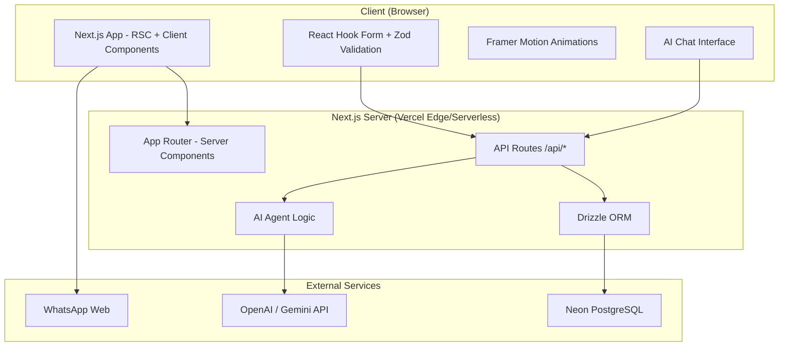
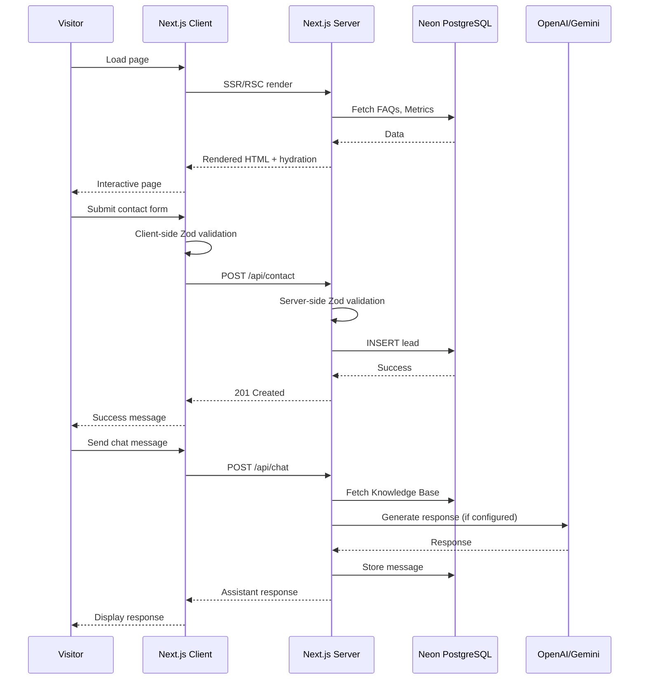
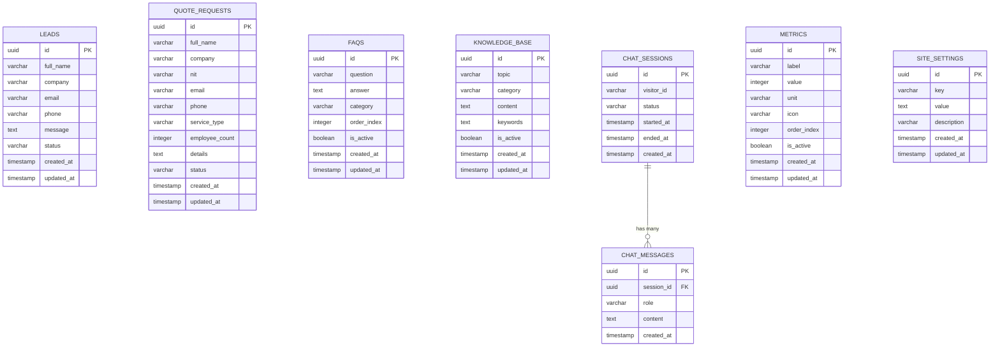

# Design Document: ASGRO Landing Page

## Overview

This design describes a production-ready, full-stack landing page for ASGRO LTDA, an insurance agency specializing in occupational risk management (ARL), workplace safety and health (SST), and corporate insurance. The application is built with Next.js 15+ using the App Router, TypeScript in strict mode, Tailwind CSS, shadcn/ui, and Framer Motion. It connects to a Neon PostgreSQL database via Drizzle ORM and deploys on Vercel.

The landing page serves as ASGRO's primary digital presence, combining corporate information sections, lead capture forms, an AI-powered chat assistant, and dynamic content from a database. The architecture maximizes Server Components for static content while isolating interactivity (forms, chat, animations) to Client Components, achieving high Lighthouse performance scores.

### Key Design Decisions

1. **Server Components by default**: All informational sections (Hero, About, Services, Methodology, etc.) render as Server Components. Only interactive elements (forms, chat, animated counters, modals) use Client Components.
2. **Progressive enhancement with fallbacks**: Every database-dependent section has hardcoded fallback data, ensuring the page renders correctly even without database connectivity.
3. **AI Agent with dual mode**: The chat assistant supports external AI APIs (OpenAI/Gemini) when configured, falling back to local keyword matching against the Knowledge Base.
4. **Shared validation schemas**: Zod schemas are defined once and reused across client-side form validation and server-side API route validation.
5. **8px spacing system**: All spacing uses multiples of 8px, enforced via Tailwind CSS configuration.

---

## Architecture

### High-Level Architecture Diagram



### Request Flow



### Folder Structure

```
src/
├── app/
│   ├── layout.tsx              # Root layout with metadata, fonts, providers
│   ├── page.tsx                # Main landing page (Server Component)
│   ├── sitemap.ts              # Dynamic sitemap generation
│   ├── robots.ts               # Robots.txt generation
│   └── api/
│       ├── health/route.ts     # Health check endpoint
│       ├── time/route.ts       # Time endpoint (America/Bogota)
│       ├── contact/route.ts    # Lead submission
│       ├── quote/route.ts      # Quote request submission
│       ├── chat/route.ts       # AI chat endpoint
│       ├── faqs/route.ts       # FAQ retrieval
│       └── metrics/route.ts    # Metrics retrieval
├── components/
│   ├── ui/                     # shadcn/ui components (Button, Input, etc.)
│   ├── layout/
│   │   ├── Header.tsx          # Sticky header with glassmorphism
│   │   ├── Footer.tsx          # Dark footer with links
│   │   ├── MobileNav.tsx       # Mobile navigation overlay
│   │   └── SkipNav.tsx         # Skip navigation link
│   ├── sections/
│   │   ├── HeroSection.tsx     # Hero with gradient, badges, CTAs
│   │   ├── PillarsSection.tsx  # 4 strategic pillars
│   │   ├── AboutSection.tsx    # About us content
│   │   ├── MissionVision.tsx   # Mission & Vision cards
│   │   ├── WhyChooseSection.tsx # 5 differentiators
│   │   ├── ServicesSection.tsx # Service cards + modal
│   │   ├── SSTARLSection.tsx   # SST and ARL detail
│   │   ├── MethodologySection.tsx # Timeline steps
│   │   ├── MetricsSection.tsx  # Animated counters (Client)
│   │   ├── BenefitsSection.tsx # Benefits grid
│   │   ├── FAQSection.tsx      # Accordion FAQ (Client)
│   │   ├── AIAgentSection.tsx  # Chat interface (Client)
│   │   ├── ContactSection.tsx  # Contact form (Client)
│   │   └── QuoteSection.tsx    # Quote form (Client)
│   ├── shared/
│   │   ├── AnimatedSection.tsx # Framer Motion viewport animation wrapper
│   │   ├── ServiceModal.tsx    # Service detail modal
│   │   ├── WhatsAppButton.tsx  # Floating WhatsApp CTA
│   │   └── Counter.tsx         # Animated number counter
│   └── chat/
│       ├── ChatWindow.tsx      # Chat message list
│       ├── ChatInput.tsx       # Message input with character counter
│       └── ChatBubble.tsx      # Individual message bubble
├── lib/
│   ├── db/
│   │   ├── index.ts            # Drizzle client initialization
│   │   ├── schema.ts           # Drizzle schema definitions
│   │   └── seed.ts             # Database seeding script
│   ├── validations/
│   │   ├── contact.ts          # Contact form Zod schema
│   │   ├── quote.ts            # Quote form Zod schema
│   │   └── chat.ts             # Chat message Zod schema
│   ├── ai/
│   │   ├── agent.ts            # AI agent orchestration
│   │   ├── keyword-matcher.ts  # Local fallback keyword matching
│   │   └── providers.ts        # OpenAI/Gemini provider abstraction
│   ├── utils/
│   │   ├── whatsapp.ts         # generateWhatsAppUrl helper
│   │   ├── format.ts           # Number formatting, date helpers
│   │   └── constants.ts        # Fallback data, static content
│   └── config/
│       └── env.ts              # Environment variable validation
├── styles/
│   └── globals.css             # Tailwind directives, custom utilities
├── types/
│   └── index.ts                # Shared TypeScript interfaces
└── public/
    ├── images/                 # Optimized static images
    └── favicon.ico
```

---

## Components and Interfaces

### Server Components (Static Content)

| Component | Description | Data Source |
|-----------|-------------|-------------|
| `HeroSection` | Dark gradient hero with headline, badges, service cards, CTAs | Static props |
| `PillarsSection` | 4 strategic pillar cards with hover animations | Static props |
| `AboutSection` | Company description, specializations, value proposition | Static props |
| `MissionVision` | Mission and vision cards side-by-side | Static props |
| `WhyChooseSection` | 5 differentiator cards with staggered animation | Static props |
| `ServicesSection` | 4 service category cards (modal is Client) | Static props |
| `SSTARLSection` | SST and ARL detailed content blocks | Static props |
| `MethodologySection` | 5-step timeline with sequential animation | Static props |
| `BenefitsSection` | 6+ benefit cards in responsive grid | Static props |
| `Footer` | Dark footer with contact info, links, social | Static props |

### Client Components (Interactive)

| Component | Description | Interactions |
|-----------|-------------|--------------|
| `Header` | Sticky glassmorphism nav bar | Scroll detection, mobile menu toggle, smooth scroll |
| `MobileNav` | Mobile navigation overlay | Open/close, link clicks |
| `MetricsSection` | Animated counter dashboard | Viewport intersection, API fetch, counter animation |
| `FAQSection` | Accordion FAQ list | API fetch, expand/collapse |
| `AIAgentSection` | Full chat interface | Message send, session management, API calls |
| `ContactSection` | Contact form with validation | Form state, validation, API submission |
| `QuoteSection` | Quote request form | Form state, validation, API submission |
| `ServiceModal` | Service detail overlay | Open/close, focus trap, escape key |
| `WhatsAppButton` | Floating WhatsApp CTA | Click to open WhatsApp |
| `AnimatedSection` | Viewport-triggered animation wrapper | Intersection Observer, Framer Motion |

### Component Interfaces

```typescript
// AnimatedSection wrapper props
interface AnimatedSectionProps {
  children: React.ReactNode;
  className?: string;
  delay?: number;          // Stagger delay in ms
  direction?: 'up' | 'down' | 'left' | 'right';
  threshold?: number;      // Viewport intersection threshold (0-1)
}

// Service modal props
interface ServiceModalProps {
  isOpen: boolean;
  onClose: () => void;
  service: {
    id: string;
    title: string;
    icon: string;
    description: string;
    subServices: string[];
  };
}

// Chat message interface
interface ChatMessage {
  id: string;
  role: 'user' | 'assistant';
  content: string;
  timestamp: Date;
}

// AI Agent chat props
interface AIAgentProps {
  initialMessages?: ChatMessage[];
}

// Metric display interface
interface MetricDisplay {
  id: string;
  value: number;
  label: string;
  unit: string;
  icon?: string;
}

// FAQ item interface
interface FAQItem {
  id: string;
  question: string;
  answer: string;
  category: string;
  orderIndex: number;
}

// WhatsApp button props
interface WhatsAppButtonProps {
  phoneNumber: string;
  message?: string;       // Pre-filled message
  variant?: 'floating' | 'inline';
  context?: string;       // Section context for message customization
}
```

### API Route Interfaces

```typescript
// POST /api/contact - Request body
interface ContactRequest {
  fullName: string;       // max 100 chars
  company: string;        // max 120 chars
  email: string;          // valid email, max 254 chars
  phone: string;          // 7-15 digits
  message: string;        // 10-2000 chars
}

// POST /api/quote - Request body
interface QuoteRequest {
  fullName: string;       // max 100 chars
  company: string;        // max 150 chars
  nit: string;            // max 20 chars, digits + hyphen
  email: string;          // valid email, max 254 chars
  phone: string;          // max 15 digits, optional leading +
  serviceType: 'arl' | 'sst' | 'insurance' | 'wellbeing';
  employeeCount: number;  // 1-99999
  details?: string;       // max 1000 chars, optional
}

// POST /api/chat - Request body
interface ChatRequest {
  sessionId?: string;     // Optional, creates new session if absent
  message: string;        // 1-500 chars
}

// POST /api/chat - Response body
interface ChatResponse {
  sessionId: string;
  response: string;
  timestamp: string;
}

// GET /api/health - Response
interface HealthResponse {
  status: 'ok' | 'degraded';
  service: string;
  timestamp: string;
  environment: string;
}

// GET /api/time - Response
interface TimeResponse {
  date: string;
  time: string;
  dayOfWeek: string;
  timezone: string;
  isBusinessHours: boolean;
}

// Standard error response
interface ErrorResponse {
  error: string;
  details?: Record<string, string[]>;
}
```

---

## Data Models

### Database Schema (Drizzle ORM)



### Drizzle Schema Definition

```typescript
// lib/db/schema.ts
import { pgTable, uuid, varchar, text, integer, boolean, timestamp } from 'drizzle-orm/pg-core';

export const leads = pgTable('leads', {
  id: uuid('id').defaultRandom().primaryKey(),
  fullName: varchar('full_name', { length: 100 }).notNull(),
  company: varchar('company', { length: 120 }).notNull(),
  email: varchar('email', { length: 254 }).notNull(),
  phone: varchar('phone', { length: 15 }).notNull(),
  message: text('message').notNull(),
  status: varchar('status', { length: 20 }).default('new').notNull(),
  createdAt: timestamp('created_at').defaultNow().notNull(),
  updatedAt: timestamp('updated_at').defaultNow().notNull(),
});

export const quoteRequests = pgTable('quote_requests', {
  id: uuid('id').defaultRandom().primaryKey(),
  fullName: varchar('full_name', { length: 100 }).notNull(),
  company: varchar('company', { length: 150 }).notNull(),
  nit: varchar('nit', { length: 20 }).notNull(),
  email: varchar('email', { length: 254 }).notNull(),
  phone: varchar('phone', { length: 15 }).notNull(),
  serviceType: varchar('service_type', { length: 30 }).notNull(),
  employeeCount: integer('employee_count').notNull(),
  details: text('details'),
  status: varchar('status', { length: 20 }).default('pending').notNull(),
  createdAt: timestamp('created_at').defaultNow().notNull(),
  updatedAt: timestamp('updated_at').defaultNow().notNull(),
});

export const faqs = pgTable('faqs', {
  id: uuid('id').defaultRandom().primaryKey(),
  question: varchar('question', { length: 500 }).notNull(),
  answer: text('answer').notNull(),
  category: varchar('category', { length: 50 }).notNull(),
  orderIndex: integer('order_index').default(0).notNull(),
  isActive: boolean('is_active').default(true).notNull(),
  createdAt: timestamp('created_at').defaultNow().notNull(),
  updatedAt: timestamp('updated_at').defaultNow().notNull(),
});

export const knowledgeBase = pgTable('knowledge_base', {
  id: uuid('id').defaultRandom().primaryKey(),
  topic: varchar('topic', { length: 200 }).notNull(),
  category: varchar('category', { length: 50 }).notNull(),
  content: text('content').notNull(),
  keywords: text('keywords').notNull(),
  isActive: boolean('is_active').default(true).notNull(),
  createdAt: timestamp('created_at').defaultNow().notNull(),
  updatedAt: timestamp('updated_at').defaultNow().notNull(),
});

export const chatSessions = pgTable('chat_sessions', {
  id: uuid('id').defaultRandom().primaryKey(),
  visitorId: varchar('visitor_id', { length: 100 }),
  status: varchar('status', { length: 20 }).default('active').notNull(),
  startedAt: timestamp('started_at').defaultNow().notNull(),
  endedAt: timestamp('ended_at'),
  createdAt: timestamp('created_at').defaultNow().notNull(),
});

export const chatMessages = pgTable('chat_messages', {
  id: uuid('id').defaultRandom().primaryKey(),
  sessionId: uuid('session_id').references(() => chatSessions.id).notNull(),
  role: varchar('role', { length: 10 }).notNull(), // 'user' | 'assistant'
  content: text('content').notNull(),
  createdAt: timestamp('created_at').defaultNow().notNull(),
});

export const metrics = pgTable('metrics', {
  id: uuid('id').defaultRandom().primaryKey(),
  label: varchar('label', { length: 100 }).notNull(),
  value: integer('value').notNull(),
  unit: varchar('unit', { length: 30 }).notNull(),
  icon: varchar('icon', { length: 50 }),
  orderIndex: integer('order_index').default(0).notNull(),
  isActive: boolean('is_active').default(true).notNull(),
  createdAt: timestamp('created_at').defaultNow().notNull(),
  updatedAt: timestamp('updated_at').defaultNow().notNull(),
});

export const siteSettings = pgTable('site_settings', {
  id: uuid('id').defaultRandom().primaryKey(),
  key: varchar('key', { length: 100 }).unique().notNull(),
  value: text('value').notNull(),
  description: varchar('description', { length: 255 }),
  createdAt: timestamp('created_at').defaultNow().notNull(),
  updatedAt: timestamp('updated_at').defaultNow().notNull(),
});
```

### Validation Schemas (Zod)

```typescript
// lib/validations/contact.ts
import { z } from 'zod';

export const contactSchema = z.object({
  fullName: z.string().min(1, 'El nombre es requerido').max(100, 'Máximo 100 caracteres'),
  company: z.string().min(1, 'La empresa es requerida').max(120, 'Máximo 120 caracteres'),
  email: z.string().email('Email inválido').max(254, 'Máximo 254 caracteres'),
  phone: z.string()
    .regex(/^\d{7,15}$/, 'El teléfono debe tener entre 7 y 15 dígitos'),
  message: z.string()
    .min(10, 'El mensaje debe tener al menos 10 caracteres')
    .max(2000, 'Máximo 2000 caracteres'),
});

export type ContactFormData = z.infer<typeof contactSchema>;

// lib/validations/quote.ts
import { z } from 'zod';

export const quoteSchema = z.object({
  fullName: z.string().min(1, 'El nombre es requerido').max(100, 'Máximo 100 caracteres'),
  company: z.string().min(1, 'La empresa es requerida').max(150, 'Máximo 150 caracteres'),
  nit: z.string()
    .min(1, 'El NIT es requerido')
    .max(20, 'Máximo 20 caracteres')
    .regex(/^[\d-]+$/, 'Solo dígitos y guiones'),
  email: z.string().email('Email inválido').max(254, 'Máximo 254 caracteres'),
  phone: z.string()
    .regex(/^\+?\d{1,15}$/, 'Teléfono inválido, máximo 15 dígitos'),
  serviceType: z.enum(['arl', 'sst', 'insurance', 'wellbeing'], {
    errorMap: () => ({ message: 'Seleccione un tipo de servicio' }),
  }),
  employeeCount: z.number()
    .int('Debe ser un número entero')
    .min(1, 'Mínimo 1 empleado')
    .max(99999, 'Máximo 99,999 empleados'),
  details: z.string().max(1000, 'Máximo 1000 caracteres').optional(),
});

export type QuoteFormData = z.infer<typeof quoteSchema>;

// lib/validations/chat.ts
import { z } from 'zod';

export const chatSchema = z.object({
  sessionId: z.string().uuid().optional(),
  message: z.string()
    .min(1, 'El mensaje no puede estar vacío')
    .max(500, 'Máximo 500 caracteres'),
});

export type ChatRequestData = z.infer<typeof chatSchema>;
```

---


## Correctness Properties

*A property is a characteristic or behavior that should hold true across all valid executions of a system — essentially, a formal statement about what the system should do. Properties serve as the bridge between human-readable specifications and machine-verifiable correctness guarantees.*

### Property 1: Validation schemas accept all valid inputs and reject all invalid inputs with descriptive errors

*For any* input object conforming to the contact, quote, or chat schema constraints (correct types, within length/range limits, matching format patterns), the corresponding Zod schema SHALL parse successfully and return the validated data. *For any* input object violating one or more constraints, the schema SHALL reject with an error message identifying the specific field and rule that failed.

**Validates: Requirements 16.2, 17.3, 14.10, 20.9**

### Property 2: WhatsApp URL generation produces valid encoded URLs

*For any* valid phone number (non-empty string of digits with optional leading +) and any message string, the `generateWhatsAppUrl` function SHALL return a URL starting with `https://wa.me/` followed by the phone number with non-digit characters removed, and if a message is provided, include a `?text=` parameter with the message URI-encoded.

**Validates: Requirements 18.3, 18.4**

### Property 3: Keyword matcher returns relevant Knowledge Base entries

*For any* visitor message containing one or more keywords that exist in a Knowledge Base entry's keywords field, the keyword matcher SHALL return that entry in its results. *For any* message containing no keywords matching any Knowledge Base entry, the matcher SHALL return an empty result set or a fallback response.

**Validates: Requirements 14.7, 14.6**

### Property 4: Chat context window is bounded to last 10 messages

*For any* chat session with N messages where N > 10, the context passed to the AI provider SHALL contain exactly the last 10 messages. *For any* session with N ≤ 10 messages, the context SHALL contain all N messages.

**Validates: Requirements 14.3**

### Property 5: Time endpoint returns correct America/Bogota formatting and business hours

*For any* Date object, the time formatting logic SHALL produce a response with the date formatted in America/Bogota timezone, the day of week in Spanish, and the `isBusinessHours` field set to true if and only if the local time is between 08:00 and 18:00 on Monday through Friday.

**Validates: Requirements 20.3**

### Property 6: Environment validation rejects missing required variables with specific error messages

*For any* environment configuration object missing one or more required variables (DATABASE_URL, NEXT_PUBLIC_WHATSAPP_NUMBER), the validation function SHALL throw an error whose message includes the name of each missing required variable.

**Validates: Requirements 24.6**

---


## Error Handling

### Client-Side Error Handling

| Scenario | Behavior |
|----------|----------|
| Form validation failure | Display inline error messages per field using React Hook Form + Zod. Fields retain values. |
| API call failure (network) | Show toast/banner error message. Re-enable submit button. Preserve form data. |
| API returns 4xx | Display user-friendly error message from response. Preserve form data. |
| API returns 5xx | Display generic "service unavailable" message. Suggest WhatsApp contact. |
| Chat message send failure | Show error in chat window. Allow retry. |
| FAQ/Metrics fetch failure | Render hardcoded fallback data seamlessly. No error shown to visitor. |
| WhatsApp env not configured | Hide all WhatsApp buttons. No error shown. |

### Server-Side Error Handling

| Scenario | HTTP Status | Response |
|----------|-------------|----------|
| Invalid request body | 400 | `{ error: "Validation failed", details: { field: ["error message"] } }` |
| Database connection failure | 503 | `{ error: "Service temporarily unavailable" }` |
| Database query error | 500 | `{ error: "An error occurred processing your request" }` |
| AI API failure | 200 (degraded) | Fall back to keyword matching, return response normally |
| AI API timeout (>5s) | 200 (degraded) | Return fallback message recommending human contact |
| Missing required env var | Build failure | Error message specifying missing variable name |
| Unhandled exception | 500 | Generic error without stack traces or internal details |

### Error Handling Patterns

```typescript
// API route error handler pattern
export async function POST(request: Request) {
  try {
    const body = await request.json();
    const validated = schema.safeParse(body);

    if (!validated.success) {
      return Response.json(
        { error: 'Validation failed', details: validated.error.flatten().fieldErrors },
        { status: 400 }
      );
    }

    // Process request...
    return Response.json(result, { status: 201 });
  } catch (error) {
    if (error instanceof DatabaseError) {
      return Response.json(
        { error: 'Service temporarily unavailable' },
        { status: 503 }
      );
    }
    return Response.json(
      { error: 'An error occurred processing your request' },
      { status: 500 }
    );
  }
}
```

### Graceful Degradation Strategy

The application follows a progressive degradation model:

1. **Full functionality**: All services connected (DB + AI API)
2. **Degraded AI**: No AI API key → keyword matching mode
3. **Degraded data**: No DB connection → hardcoded fallback for FAQs, metrics
4. **Static mode**: No external services → all sections render with static content, forms show error on submit

---


## Testing Strategy

### Dual Testing Approach

This project uses both unit/example-based tests and property-based tests for comprehensive coverage.

### Property-Based Testing

**Library**: [fast-check](https://github.com/dubzzz/fast-check) (TypeScript PBT library)

**Configuration**: Minimum 100 iterations per property test.

**Tag format**: Each test tagged with `Feature: asgro-landing-page, Property {number}: {description}`

**Properties to implement**:

| Property | Module Under Test | Test Focus |
|----------|-------------------|------------|
| Property 1 | `lib/validations/*.ts` | Zod schemas accept valid inputs, reject invalid with correct errors |
| Property 2 | `lib/utils/whatsapp.ts` | URL generation correctness for all phone/message combinations |
| Property 3 | `lib/ai/keyword-matcher.ts` | Keyword matcher returns relevant KB entries |
| Property 4 | `lib/ai/agent.ts` | Context window always bounded to 10 messages |
| Property 5 | `app/api/time/route.ts` | Time formatting and business hours calculation |
| Property 6 | `lib/config/env.ts` | Missing required vars produce specific error messages |

### Unit / Example-Based Tests

| Area | Test Focus | Examples |
|------|-----------|----------|
| Components | Render correctness, accessibility | Header renders nav links, Footer has contact info |
| Forms | UI interaction, submission flow | Submit valid form → success message, invalid → errors |
| Modals | Focus trap, escape close, overlay click | Service modal traps focus, closes on Escape |
| API Routes | Integration with DB | POST /api/contact stores lead correctly |
| Responsive | Layout at breakpoints | Mobile shows hamburger, desktop shows full nav |
| Accessibility | ARIA, keyboard nav, contrast | Skip nav exists, focus indicators visible |
| SEO | Meta tags, structured data | og:title exists, JSON-LD has required fields |
| Fallbacks | Degraded mode behavior | No DB → fallback FAQs, no AI key → keyword matcher |

### Testing Tools

- **Test runner**: Vitest (fast, native ESM, compatible with Next.js)
- **Component testing**: @testing-library/react + jsdom
- **Property testing**: fast-check
- **API testing**: Vitest + fetch mocks
- **Accessibility**: jest-axe for automated a11y checks
- **E2E** (optional): Playwright for critical user flows

### Test File Organization

```
__tests__/
├── properties/
│   ├── validation-schemas.property.test.ts
│   ├── whatsapp-url.property.test.ts
│   ├── keyword-matcher.property.test.ts
│   ├── chat-context.property.test.ts
│   ├── time-formatting.property.test.ts
│   └── env-validation.property.test.ts
├── unit/
│   ├── components/
│   ├── api/
│   └── lib/
└── integration/
    ├── contact-flow.test.ts
    ├── quote-flow.test.ts
    └── chat-flow.test.ts
```

### Coverage Goals

- **Property tests**: 100% coverage of identified correctness properties
- **Unit tests**: Cover all API routes, form validation flows, fallback scenarios
- **Integration tests**: End-to-end flows for contact, quote, and chat
- **Accessibility**: Automated axe checks on all rendered sections
